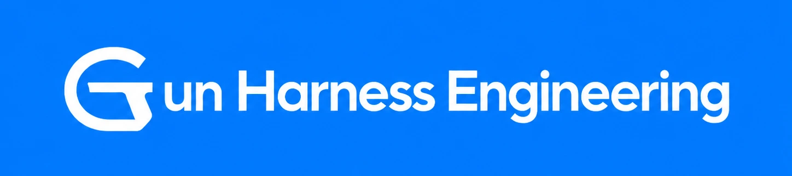
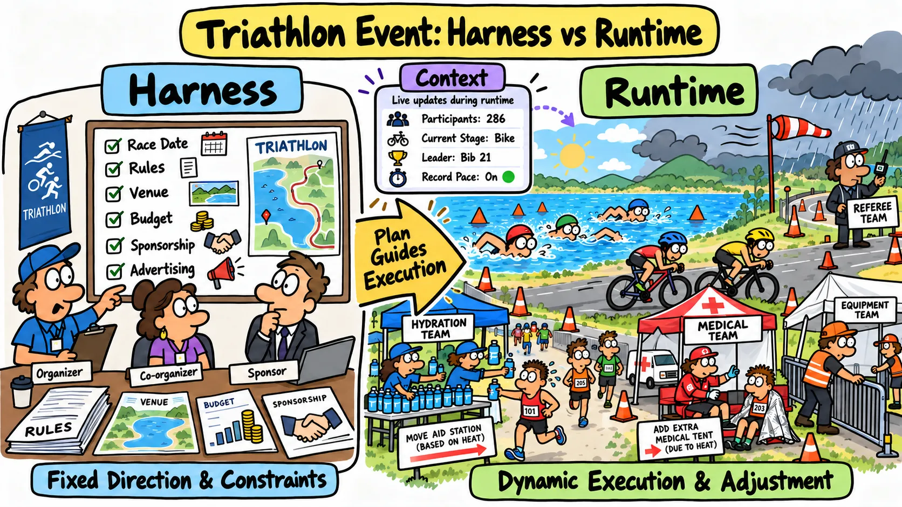
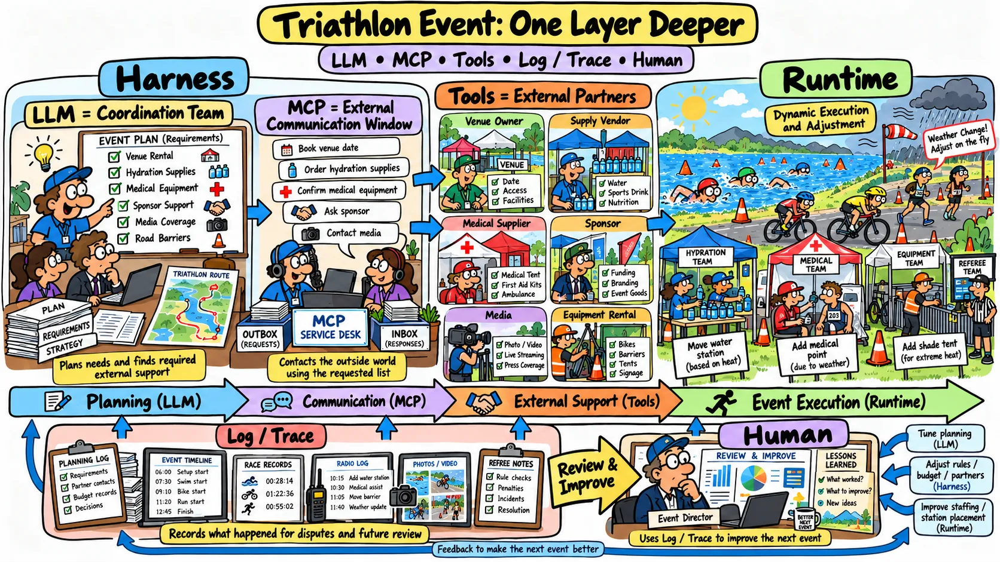
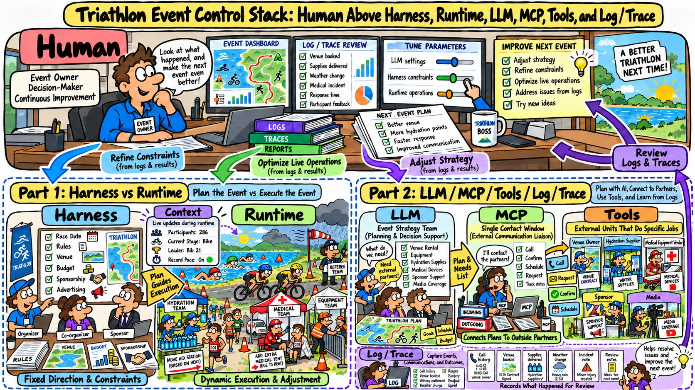
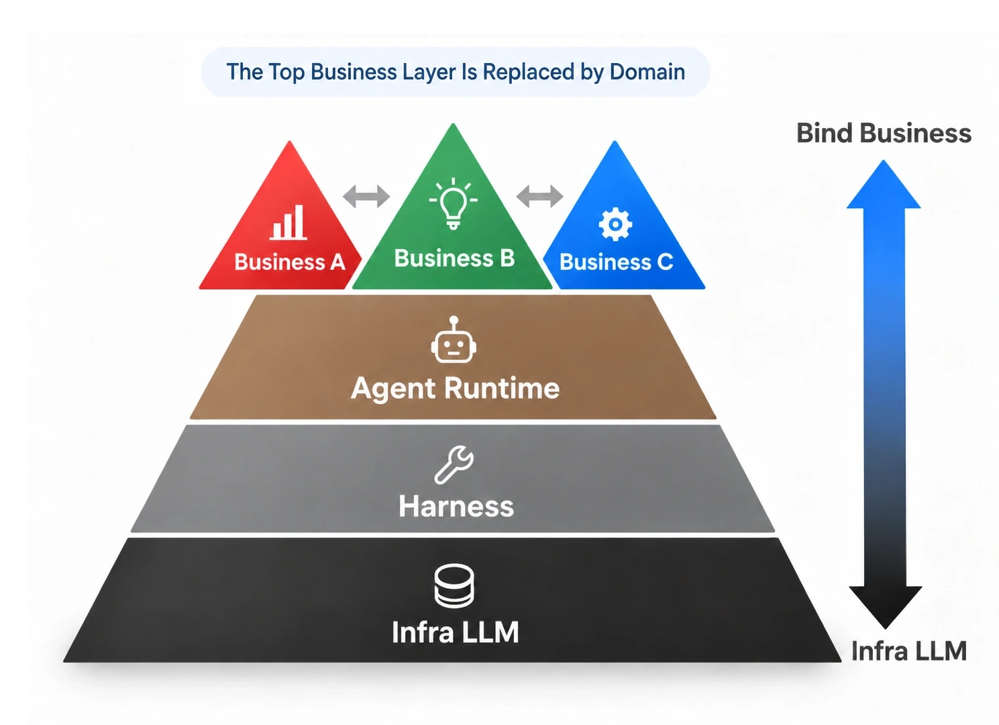

# Gun Harness Engineering

[English](./README.md) | [繁體中文](./README-zh-TW.md)

  

This is a knowledge base about how AI agents are constrained, carried through execution, and recovered from failure in real products.

- The content grew out of my hands-on work on [chat-gun](https://github.com/HsienW/chat-gun), together with my study of and reflection on [claude-code-best/claude-code](https://github.com/claude-code-best/claude-code).
- This repo does not start from the Agent Infra side or survey Harness papers. It looks at the role and capabilities of the Harness from the product-practice side, because that is what matters when shipping to real business use.

## Can You Explain Harness and Runtime Without Technical Jargon?

> If you cannot answer clearly, or if parts of your answer feel vague, this knowledge base can help you distinguish between the two.

### My Answer: Think of a Race, Such as a Triathlon

#### Part 1: Harness and Runtime

  

- Harness = The event organizer, which plans the overall direction of the race.
  - Examples: setting the date / defining the rules / securing the venue / raising funds / finding sponsors. These tasks set the direction and tend to remain fixed.

- Runtime = The equipment, aid station, and medical crews that carry out the work and adapt while the race is underway.
  - Examples: adjusting the number and location of aid stations based on the weather / moving medical stations / adding or removing equipment tents. These decisions happen during the race and need to remain flexible.

- Context = The information that keeps changing as the race unfolds.
  - Examples: how many athletes are competing / which stage is in progress / who is leading / whether anyone has broken a record.

#### Part 2: Other Agent Capabilities

  

- LLM = The coordination team within the event organization. It plans the race and determines which outside partners are needed.
  - Examples: deciding whether the race needs another equipment provider / choosing who to rent the venue from / working out how to obtain equipment / deciding whether to seek support from sponsors and advertisers.

- MCP = The event organizer's single point of contact for external communication. It contacts outside partners according to the list prepared by the coordination team.
  - Examples: contacting the venue owner / confirming rental dates / notifying suppliers that provide race provisions / contacting medical equipment vendors.

- Tool = Each outside partner named on the race checklist.
  - Examples: provision suppliers / sponsors / media outlets covering the event.

- Log / Trace = Records from the race that help review disputes and improve the next event.
  - Examples: referees / photographers / timing systems.

#### Part 3: What Humans Are Responsible For

  

- Human = The owner of the event organization. The owner uses Log / Trace to observe and control the following roles so the next race can run better.
  - Coordination team (LLM) + event organizer (Harness) + equipment, aid station, and medical crews (Runtime) + information generated during the race (Context)
  - Outside partners (Tool)
  - Replacing the coordination team (Change Model)
  - Running a different type of race (Change Business)

> In plain language, Runtime operates within the boundaries planned by the Harness and adapts as needed. Context is the information being processed, while Tools provide additional capabilities.
> Humans use the LLM, Harness, Runtime, and other components to control the Agent for different Business needs.

## What I Mean by Harness and Runtime in Technical Terms

- The commonly accepted view in the industry today is Agent = Harness + LLM. Breaking that down further gives the figure below:

  

The figure shows four parts, from bottom to top (the top layer is swapped depending on the business; the lower you go, the more general the Agent capability):

1. Infra: The model layer. GPT-5 / GPT-6 and the Claude Opus / Sonnet series are familiar examples.
2. Harness: The control layer over the model, the controller that decides capabilities and overall direction. Examples: the composition and orchestration layer (Prompt / Workflow), the connection layer (protocols such as API / MCP), and the capability layer (Skills / Tools) all sit here.
3. Runtime: Once the controller has set the overall direction, Runtime governs what actually happens while the agent runs. Examples: sandbox environment, state and memory, retry, throttling, permission governance, and Trace observability all sit here.
4. Business: Where a specific business adds its own Domain on top of the first three layers. This is also what FDEs do today. Examples: agents deployed in education, finance, aviation, and other domains.

**Because Business is tied to specific domains, and Infra belongs to model capability and model training, this repo focuses only on the following two threads:**

- **Harness**: How the product decides what the Agent sees, which capabilities it can use, how its actions get authorized, and how humans step in and trace its path.
- **Runtime**: How a single Agent Run advances its state, executes the model and tools, handles external side effects, recovers from failure, and leaves evidence that operators can inspect.

## Why This Knowledge Base Exists

Agent architecture is often written up as a list of components: Prompt, Memory, Tool, Workflow, Tracing, Evaluation. A list like this does not answer who owns the decisions, where execution crosses a trust boundary, or what to do when a tool has actually succeeded but the response was lost.

This repo starts from questions closer to how agents actually run:

- Which responsibilities belong to the Harness, and which to the Runtime?
- When user input, historical memory, and external data conflict, who has higher authority?
- Who can approve an action that changes the outside world?
- How does a tool failure get fed back to the model without breaking the conversation structure?
- Which set of identifiers can link a user request, a Run, a model request, a tool call, and a side effect?
- After a process crashes, which state can be safely recovered?
- Which capabilities have gone through the official execution path, and which are still only modules or plans?

## Knowledge Base Map

~~~text
gun-harness-engineering/
├─ README.md
├─ README-zh-TW.md
├─ agent-harness/
│  ├─ foundations/
│  ├─ input-and-context/          # planned
│  ├─ behavior-and-capabilities/  # planned
│  ├─ action-governance/          # planned
│  └─ interaction-and-feedback/   # planned
└─ agent-runtime/                 # planned
   ├─ foundations/
   ├─ execution-lifecycle/
   ├─ model-and-tool-execution/
   ├─ effects-and-recovery/
   └─ events-and-operations/
~~~

### Agent Harness

- The Harness is the control layer between the product, the model, the tools, and the Runtime. It defines the conditions under which the Agent understands a task, chooses capabilities, and takes action.
- Core topics include input normalization, Context assembly, instruction and capability configuration, trust boundaries, tool risk, Permission, Human Approval, mid-run input, cancellation, follow-up questions, and feedback.
- Start with the [Agent Harness overview](./agent-harness/README.md).

### Agent Runtime

- The Runtime is the execution core the Harness relies on. It is responsible for moving an Agent Run to a valid terminal state.
- Planned coverage: Execution Identity, model streaming, tool scheduling, retry, error feedback to the model, Checkpoint, Interrupt, Resume, conversation repair, Idempotency, Side-effect Ledger, Reconciliation, Compensation, Runtime Event, Tracing, Metrics, and launch criteria.

## The Full Harness and Runtime Handoff Flow

~~~text
Product receives an interaction
  → Harness normalizes the input
  → Harness assembles Context, rules, and capabilities
  → Runtime runs the model and tool loop
  → Runtime asks the Harness for a policy or human decision
  → Runtime produces messages, events, and a terminal result
  → Harness presents the result and picks up the next interaction
~~~

This describes a boundary of responsibility, not a directory boundary. In real code, both sides may live in the same module. What to ask when judging is who actually owns each decision and each state transition.

## Engineering Markers

Four states are distinguished:

| State | Meaning |
|---|---|
| Observed | Confirmed in the code paths of Claude Code that were taken apart |
| Integrated | Wired into Chat Gun's official execution path |
| Module available | The primitive or module exists, but the official wiring is still incomplete |
| Planned | A design that still needs to be implemented and verified |

The existence of a class, a Schema, or a unit test does not mean an end-to-end Runtime capability is in place.

## License

This project is licensed under the [MIT License](./LICENSE). Copyright (c) 2026 Hsien Wei.
