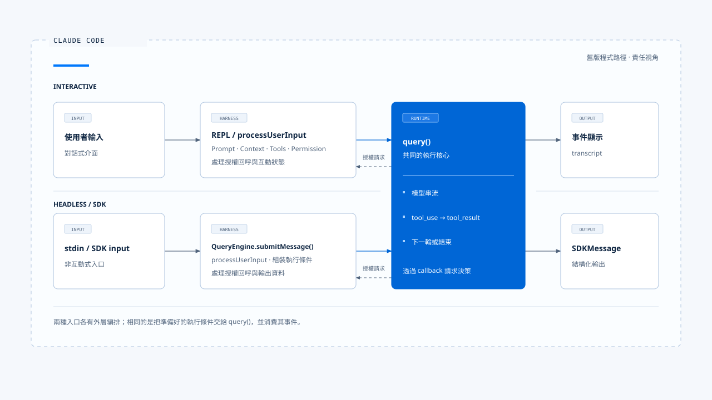
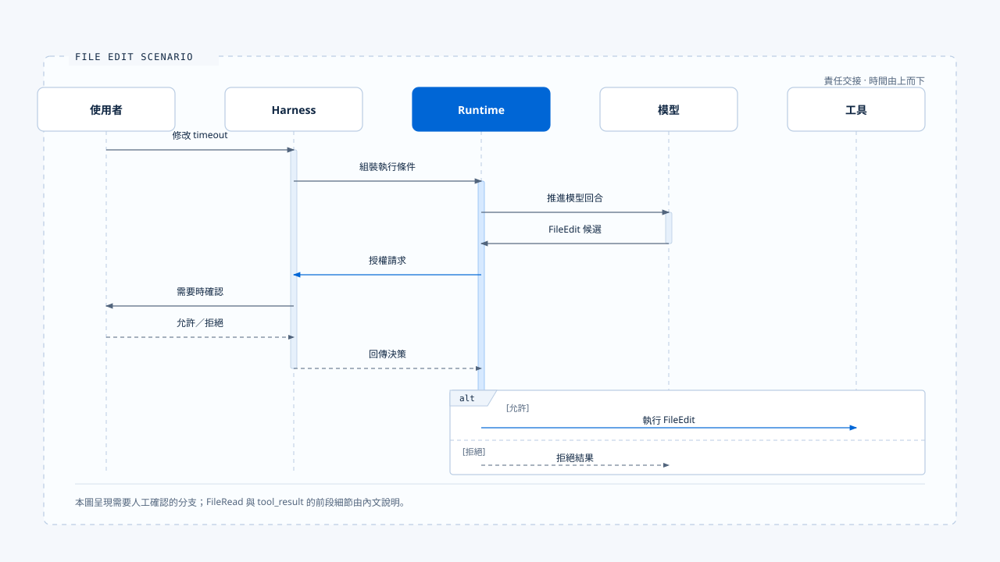

# 實際落地的 Agent Harness 是什麼?

[English](./01-what-is-agent-harness.md) | [繁體中文](./01-what-is-agent-harness-zh-TW.md)

- 我認為 Agent Harness 是產品放在模型與真實世界之間的控制層
  - 它整理使用者輸入
  - 決定模型此刻能看見哪些資料
  - 可以使用哪些能力
  - 採取行動前要經過哪些檢查
  - 也規定使用者如何在執行中補充、取消或批准操作

> 這個定義關心的是「責任」，不要求專案裡一定存在名為 Harness 的 class、package 或目錄。
> 對比在 Claude Code 的相關責任是分散在啟動組裝、REPL、QueryEngine、輸入處理、Prompt、Tool registry、Permission。
> 顯示層；把這些檔案逐一列出，只能得到元件表。沿著一次任務追蹤「誰做決定」，才看得到 Harness。

## Harness 位於哪裡

一個具備 Agent 能力的產品可以先用三層理解：

- 產品層: 承接終端、帳號、業務流程與使用者體驗。
- Harness: 把產品意圖轉成一次可執行且受治理的 Agent 任務。
- Runtime: 接手之後，負責讓該任務實際運轉到完成、取消或失敗。

這三層可能寫在同一個程式裡。分層的用途是釐清決策權與狀態所有權，而非要求每層都成為獨立服務。

## Harness 持有的五個決策面

### 1. 輸入

**Harness 先判斷「使用者到底提交了什麼」:**

一段輸入可能同時含有文字、附件、圖片、IDE selection、Slash Command 或對既有任務的補充。這些來源需先被辨識、驗證並轉成一致的輸入契約，Runtime 才知道該開始新任務、延續舊任務，或只執行本地命令。
Claude Code 的 processUserInput 會處理一般訊息、附件與命令分流。Interactive 與 Headless 模式的入口不同，但兩者都必須先完成這層轉換，才把資料送入核心 Agent loop。

### 2. 上下文 (Context)

**Harness 決定「這一輪要讓模型知道什麼」:**

上下文 (Context) 不只包含歷史訊息，也可能包括 System Prompt、專案指令、目前目錄、檔案內容、記憶、Tool Result 與使用者附件。Harness 需要處理來源權威、優先序、Token 預算與壓縮策略。
這項責任會直接改變模型行為。相同模型與相同問題，在不同 Context 組裝下可能選擇不同工具、忽略不同限制，甚至理解成不同任務。

### 3. 行為與能力

**Harness 決定「Agent 被允許考慮哪些做法」:**

System Prompt 與專案規則描述行為；Tool、Skill、MCP、Command 與 Subagent 定義可用能力。能力是否出現在模型面前，也是一項政策決定。某個 Tool 已經實作，不代表每個 Agent、模式與使用者都應看見它。
Claude Code 會依啟動模式、設定、Feature Gate、身份、目錄信任與 Permission mode 組裝能力。Chat Gun 面對的則是 C 端業務工具、租戶資源與不同 Agent Graph。產品不同，控制問題相同：能力必須在進入模型與進入執行器之前受到約束。

### 4. 行動治理

**Harness 決定「模型提出的行動能否真的執行」:**

模型可以提出 FileEdit、Shell、退款或通知等工具呼叫；執行權仍由系統持有。Harness 應根據 Tool 風險、作用資源、Principal、Scope、Policy 與使用者批准作出決策，再把結果交回 Runtime。
因此，Tool 對模型可見與本次 Tool Call 獲准是兩個不同問題。前者屬於能力配置，後者屬於特定行動的授權。

### 5. 互動與回饋

**Harness 決定「執行期間，人與 Agent 如何繼續對話」:**

使用者可能在任務執行中補充條件、要求取消、送出第二個問題，或回覆一項人工確認。Harness 必須決定這筆輸入屬於目前 Run、下一個 Run，還是應取代正在執行的工作。
任務結束後，Harness 還要把 Runtime 事件轉成使用者看得懂的進度、錯誤與結果。評估資料也從這裡形成，用來檢查既有約束是否真的改善行為。

## 對比在 Claude Code 看見責任邊界

在分析的 Claude Code 復刻版中，Interactive 與 Headless／SDK 並未共用同一個外層編排器：

兩條路徑最後都把準備好的執行資料交給 query()

> query() 與內部 query loop 負責模型串流、解析 tool_use、執行工具、回填 tool_result，然後決定繼續下一輪或結束。

這提供了一條可操作的分界: 
1. Harness 組裝執行條件
2. Runtime 執行 Agent loop，再由 Harness 消費訊息與事件

Runtime 執行期間仍可能呼叫 Harness 提供的介面。例如工具準備執行時，Runtime 透過 Permission callback 請求決策；Interactive Harness 可以顯示確認視窗，Headless Harness 則可以把請求交給 SDK host。Runtime 不需要知道決策來自 TUI、遠端服務或預先設定的政策，只需遵守回傳結果。
由此可見，Harness 與 Runtime 的交接不是單向函式呼叫，而是一組雙向契約：執行輸入向內流，政策決策在需要時回應，訊息與事件再向外流。

## 落地場景: 以一個檔案修改當範例

**假設使用者輸入：「把 src/app.ts 的 timeout 改成 30 秒。」**

Harness 先完成以下工作：

1. 將文字與 IDE Context 轉成標準輸入。
2. 組裝專案規則、對話歷史與目前工作目錄。
3. 提供 FileRead 與 FileEdit 等本次可用工具。
4. 設定 FileEdit 的 Permission policy。
5. 把以上資料交給 Runtime。

Runtime 開始模型與工具迴圈：
1. 模型先提出 FileRead，Runtime 執行後把內容回灌
2. 模型接著提出 FileEdit。到了修改動作，Runtime 呼叫 Harness 提供的 Permission 介面
   - 若政策規則允許，Runtime 執行 FileEdit，再讓模型整理結果
   - 若需要人工確認，Harness 顯示操作內容並等待使用者 ➜ 若使用者拒絕，Harness 回傳拒絕決策，Runtime 將拒絕結果放回對話，讓模型改用其他方法或說明無法繼續。

這個場景中，**模型提出候選行動**，再者**Harness 持有行動條件與決策權**，最後**Runtime 持有執行順序與狀態轉移**。三者各自負責一段不同的問題。

## 從前述的 Coding Agent 的範例延伸到 Chat Gun 的開發經驗

場景落地的類型: 
1. Coding Agent 的外部世界主要是檔案、Shell、Git、MCP 與開發環境。
2. Chat Gun 這類 C 端任務 Agent 會接觸帳號、租戶資料、搜尋服務與未來的業務操作。
   - 當 Tool 只讀取天氣時，Harness 需要決定位置與隱私資料如何進入 Context
   - 當 Tool 會退款、預約或發送通知時，Harness 還需要判斷 Principal、Resource Scope、風險等級與批准條件。

Runtime 承接問題的類型：
1. 工具是否可以並行、逾時後能否重試
2. 外部操作已成功但回應遺失時如何回查
3. 程序崩潰後能否安全恢復、是否有副作用

以上的分工讓同一套 Harness 定義可以跨越 Coding Agent 與業務型 Agent，同時保留各自的風險模型。

## 如何判斷一個系統是否有完整 Harness

可以沿一次真實任務問七個問題：

1. 哪些輸入形式可以進入 Agent，誰負責驗證與正規化？
2. 哪些資料會進入模型，來源衝突時如何排序？
3. 本次任務能看見哪些能力，由誰配置？
4. 模型提出行動後，由誰決定允許、拒絕或請人確認？
5. 使用者在執行中再次輸入時，如何判斷歸屬？
6. Runtime 以什麼訊息與事件契約回傳結果？
7. 如何證明上述政策確實存在於正式執行路徑？

> 前六題描述控制面，第七題要求落地證據。
> 若規則只寫在 Prompt、文件或一個沒有接線的模組裡，它仍只是設計材料，尚未成為產品的 Harness 行為。

## 場景角色的概念的責任

| 概念 | 在本知識庫中的責任 |
|---|---|
| Agent Product | 提供使用者體驗、帳號、業務流程與產品政策 |
| Agent Harness | 組裝任務條件，約束 Agent 的認知、能力、行動與互動 |
| Agent Runtime | 執行 Run 生命週期、模型與工具迴圈、狀態轉移及恢復 |
| Agent Framework | 提供 Graph、Message、Tool、Checkpoint 等開發原語 |
| System Prompt | Harness 使用的一種行為控制材料 |
| Tool Runtime | Runtime 中負責 Tool 驗證、排程、執行與結果處理的部分 |
| Evaluation | 檢查 Harness 規則與 Runtime 行為是否產生預期結果 |

- 框架可以承載 Harness，也可以承載 Runtime；但採用 LangGraph、LangChain 或自製 loop，並不會自動回答產品的輸入權威、能力範圍與授權政策。

## 責任邊界

- 這套定義適合會讓模型自主選擇步驟、呼叫工具，並可能接受執行中介入的 Agent 產品。單次文字補全也有 Prompt 與輸入處理，但若沒有能力選擇、行動治理或持續執行狀態，使用完整 Harness 模型的收益有限。
- Harness 也無法替代領域授權系統。它可以在 Tool dispatch 前呼叫授權服務並執行決策，不能自行宣告某個使用者擁有退款、醫療資料或企業資源的權限。

## Harness 的定義

- Harness 在 Agent Product 中負責組裝輸入、Context、行為規則與能力，治理模型提出的行動，並承接人與 Runtime 互動的控制層。
- Harness 在工程線索中，每項規則都應找到決策者、執行位置與可觀測結果。如此一來，Harness 才能從概念變成可驗證的產品行為。

## 參考落地的來源

### [claude-code-best](https://github.com/claude-code-best/claude-code)

- claude-code-best：src/screens/REPL.tsx
- claude-code-best：src/QueryEngine.ts
- claude-code-best：src/query.ts
- claude-code-best：src/utils/processUserInput/processUserInput.ts
- claude-code-best：ARCHITECTURE.md

### Chat Gun 的使用方式

- Chat Gun 在本篇只用於檢查這套定義能否延伸到 C 端任務 Agent
- 個別能力是否已接入正式路徑，仍應依對應文章與程式證據標為「已接入」、「模組可用」或「規劃中」。

## 接續閱讀

- [Harness 的控制面](./02-control-surfaces.md)
- [Harness 與 Runtime 的邊界](./03-harness-runtime-boundary.md)
- [Agent Harness 設計原則](./04-design-principles.md)
- [一次任務的完整走法](./05-one-turn-walkthrough.md)
