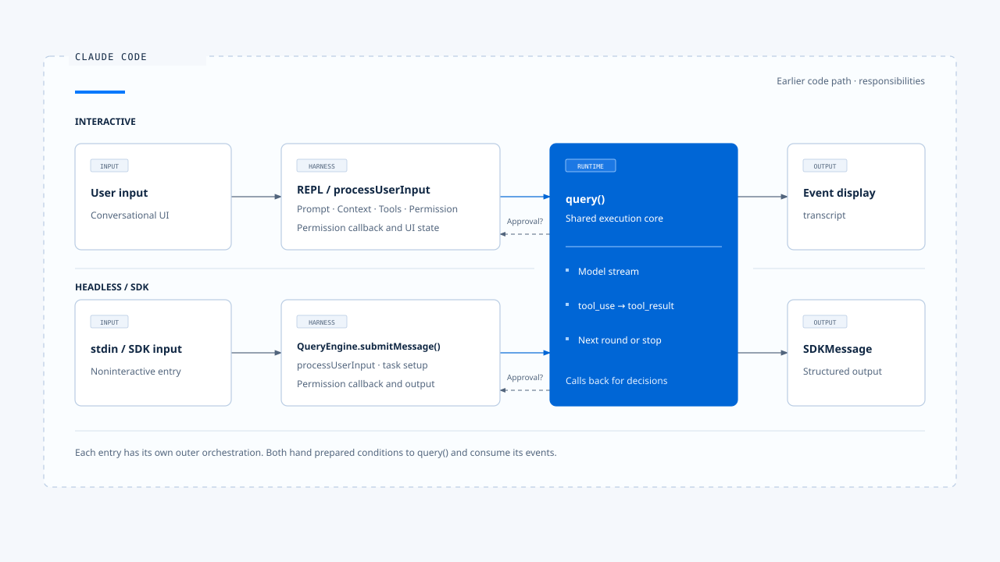
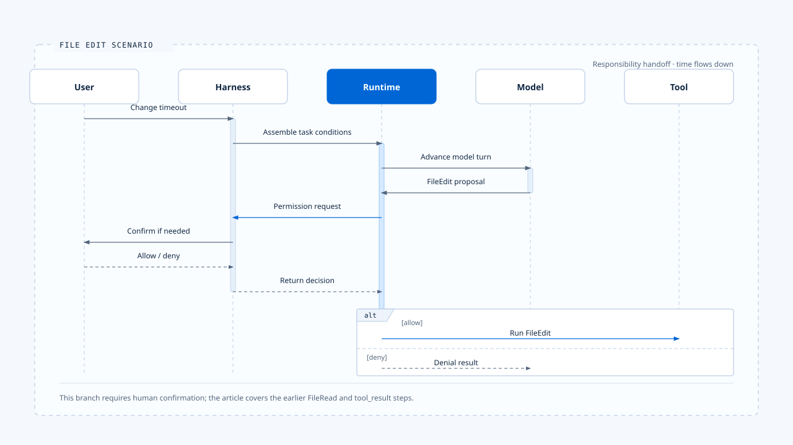

# What Is an Agent Harness in Practice?

[English](./01-what-is-agent-harness.md) | [繁體中文](./01-what-is-agent-harness-zh-TW.md)

- I see an Agent Harness as the control layer a product places between the model and the real world.
  - It organizes user input.
  - It decides what data the model can see at a given moment.
  - It determines which capabilities the model may use.
  - It specifies the checks required before an action.
  - It defines how users can add information, cancel, or approve an operation while it runs.

> This definition concerns responsibility. It does not require a class, package, or directory named Harness in the project.
> In Claude Code, these responsibilities are spread across startup assembly, REPL, QueryEngine, input handling, Prompt, the Tool registry, and Permission.
> The display layer is involved as well. Listing these files only gives you a component inventory. To see the Harness, trace who makes each decision during a task.

## Where the Harness Sits

An Agent-enabled product can be understood in three layers:

- Product layer: Handles terminals, accounts, business workflows, and user experience.
- Harness: Turns product intent into an Agent task that can run under defined controls.
- Runtime: Takes over execution and runs the task until it completes, is canceled, or fails.

These three layers may live in the same program. The point of separating them is to clarify decision authority and state ownership, not to require a separate service for each layer.

## The Five Decision Surfaces Owned by the Harness

### 1. Input

**The Harness first asks, "What did the user submit?":**

An input may contain text, attachments, images, an IDE selection, a Slash Command, or an addition to an existing task. The Harness must identify and validate these sources, then turn them into a consistent input contract so the Runtime knows whether to start a new task, continue an existing one, or run only a local command.
Claude Code's processUserInput handles ordinary messages, attachments, and command routing. Interactive and Headless modes have different entry points, but both must complete this conversion before passing data to the core Agent loop.

### 2. Context

**The Harness decides, "What should the model know in this round?":**

Context includes more than message history. It may also include the System Prompt, project instructions, the current directory, file contents, memory, Tool Results, and user attachments. The Harness must handle source authority, precedence, the Token budget, and compression strategy.
This responsibility can change the model's behavior. Given the same model and question, different Context assemblies may lead it to choose different tools, disregard different constraints, or even understand the task differently.

### 3. Behavior and Capabilities

**The Harness decides, "Which approaches may the Agent consider?":**

The System Prompt and project rules describe behavior; Tools, Skills, MCP, Commands, and Subagents define available capabilities. Deciding whether the model can see a capability is itself a policy decision. The fact that a Tool exists does not mean every Agent, mode, and user should see it.
Claude Code assembles capabilities according to launch mode, settings, Feature Gates, identity, directory trust, and Permission mode. Chat Gun deals with consumer-facing business tools, tenant resources, and different Agent Graphs. The products differ, but the control problem is the same: capabilities must be constrained before the model sees them and before an executor runs them.

### 4. Action Governance

**The Harness decides, "May the model's proposed action actually run?":**

The model may propose Tool Calls such as FileEdit, Shell, a refund, or a notification, but the system retains execution authority. The Harness should decide based on Tool risk, the affected resource, Principal, Scope, Policy, and user approval, then return the decision to the Runtime.
Making a Tool visible to the model and approving a specific Tool Call are two separate questions. The first concerns capability configuration; the second concerns authorization for a particular action.

### 5. Interaction and Feedback

**The Harness decides, "How do people and the Agent keep talking during execution?":**

While a task runs, a user may add a constraint, request cancellation, ask a second question, or respond to an approval request. The Harness must decide whether that input belongs to the current Run or the next one, or whether it should replace the work in progress.
When the task ends, the Harness must also turn Runtime events into progress, errors, and results that users can understand. Evaluation data takes shape here too, so the team can check whether the existing controls improve behavior.

## Seeing the Responsibility Boundary in Claude Code

In the Claude Code replica analyzed here, Interactive and Headless/SDK do not share the same outer orchestrator:

Both paths eventually pass prepared execution data to query().

> query() and its internal query loop handle model streaming, parse tool_use, run tools, feed back tool_result, and then decide whether to continue for another round or stop.

This gives us a practical boundary:
1. The Harness assembles the execution conditions.
2. The Runtime runs the Agent loop, and the Harness consumes its messages and events.

During execution, the Runtime may still call an interface supplied by the Harness. Before running a tool, for example, the Runtime requests a decision through a Permission callback. An Interactive Harness can show a confirmation dialog, while a Headless Harness can pass the request to an SDK host. The Runtime does not need to know whether the decision came from a TUI, a remote service, or a preset policy; it only needs to follow the returned result.
The handoff between Harness and Runtime is therefore a two-way contract rather than a one-way function call: execution input flows inward, policy decisions return when needed, and messages and events flow outward.

## Implementation Scenario: Modifying a File

**Suppose the user enters: "Change the timeout in src/app.ts to 30 seconds."**

The Harness first does the following:

1. Converts the text and IDE Context into standard input.
2. Assembles project rules, conversation history, and the current working directory.
3. Provides FileRead, FileEdit, and other Tools available for this task.
4. Sets the Permission policy for FileEdit.
5. Passes this data to the Runtime.

The Runtime starts the model and tool loop:
1. The model proposes FileRead. The Runtime runs it and feeds the file contents back.
2. The model then proposes FileEdit. When it reaches the modification, the Runtime calls the Permission interface supplied by the Harness.
   - If policy allows the action, the Runtime runs FileEdit and lets the model summarize the result.
   - If human confirmation is required, the Harness shows the proposed operation and waits for the user. If the user denies it, the Harness returns a denial decision, and the Runtime puts that result back into the conversation so the model can try another approach or explain why it cannot continue.

In this scenario, **the model proposes candidate actions**, **the Harness owns the conditions and decision authority for those actions**, and **the Runtime owns execution order and state transitions**. Each is responsible for a different part of the problem.

## Applying the Coding Agent Example to Chat Gun Development

Types of implementation scenarios:
1. A Coding Agent's external world consists mainly of files, Shell, Git, MCP, and the development environment.
2. A consumer-facing task Agent such as Chat Gun may access accounts, tenant data, search services, and future business operations.
   - When a Tool only reads the weather, the Harness must decide how location and private data enter Context.
   - When a Tool can issue refunds, make reservations, or send notifications, the Harness must also assess Principal, Resource Scope, risk level, and approval conditions.

Types of problems the Runtime handles:
1. Whether Tools can run in parallel and whether a timed-out call can be retried.
2. How to check an external operation that succeeded when its response was lost.
3. Whether the system can recover safely after a process crash and whether recovery may cause side effects.

This division of responsibilities lets the same Harness definition cover both Coding Agents and business Agents while retaining their different risk models.

## How to Tell Whether a System Has a Complete Harness

Follow a real task and ask seven questions:

1. Which input formats can enter the Agent, and who validates and normalizes them?
2. Which data reaches the model, and how are conflicting sources ordered?
3. Which capabilities can this task see, and who configures them?
4. After the model proposes an action, who decides to allow it, deny it, or ask a person?
5. When the user provides more input during execution, how is that input assigned?
6. What message and event contract does the Runtime use to return results?
7. How can we prove that these policies exist in the production execution path?

> The first six questions describe the control surface; the seventh calls for implementation evidence.
> If a rule exists only in a Prompt, a document, or a module that is not connected to execution, it is still design material, not product Harness behavior.

## Conceptual Responsibilities of Each Role

| Concept | Responsibility in this knowledge base |
|---|---|
| Agent Product | Provides user experience, accounts, business workflows, and product policy |
| Agent Harness | Assembles task conditions and constrains what the Agent knows, can do, and can act on, as well as how it interacts |
| Agent Runtime | Runs the Run lifecycle, model and tool loop, state transitions, and recovery |
| Agent Framework | Provides development primitives such as Graph, Message, Tool, and Checkpoint |
| System Prompt | A behavior-control input used by the Harness |
| Tool Runtime | The part of the Runtime that validates, schedules, runs, and processes Tool results |
| Evaluation | Checks whether Harness rules and Runtime behavior produce the expected results |

- A framework can host both Harness and Runtime, but adopting LangGraph, LangChain, or a custom loop does not answer questions about input authority, capability scope, or authorization policy for the product.

## Responsibility Boundaries

- This definition applies to Agent products that let a model choose steps, call tools, and potentially accept intervention while running. Single-turn text completion also involves Prompt and input handling, but the full Harness model offers limited benefit without capability selection, action governance, or persistent execution state.
- The Harness cannot replace a domain authorization system. It can call an authorization service before Tool dispatch and enforce its decision, but it cannot grant a user rights to refunds, medical data, or enterprise resources on its own.

## Definition of the Harness

- Within an Agent Product, the Harness is the control layer that assembles input, Context, behavior rules, and capabilities; governs actions proposed by the model; and handles interaction between people and the Runtime.
- For each Harness rule, engineers should be able to identify the decision-maker, execution point, and observable result. That is how the Harness becomes verifiable product behavior rather than a concept alone.

## Implementation References

### [chat-gun](https://github.com/HsienW/chat-gun)

### [claude-code-best](https://github.com/claude-code-best/claude-code)

- claude-code-best: src/screens/REPL.tsx
- claude-code-best: src/QueryEngine.ts
- claude-code-best: src/query.ts
- claude-code-best: src/utils/processUserInput/processUserInput.ts
- claude-code-best: ARCHITECTURE.md

### How Chat Gun Is Used Here

- This article uses Chat Gun only to test whether the definition extends to consumer-facing task Agents.
- Whether a specific capability is connected to the production path should still be labeled "integrated," "module available," or "planned," based on the relevant article and code evidence.

## Further Reading

- [Harness control surfaces](./02-control-surfaces.md)
- [The boundary between Harness and Runtime](./03-harness-runtime-boundary.md)
- [Agent Harness design principles](./04-design-principles.md)
- [The complete path of a task](./05-one-turn-walkthrough.md)
